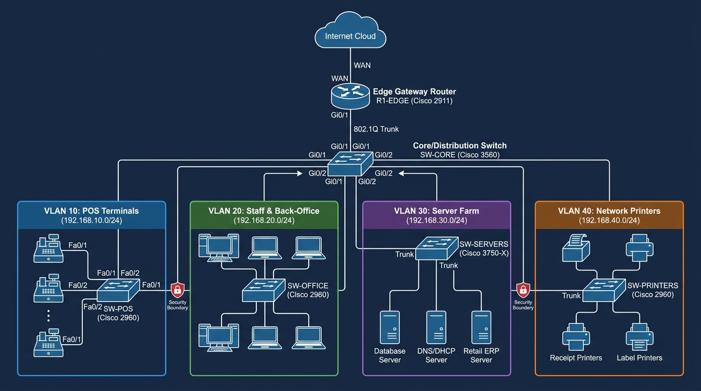

# Retail Store Network Infrastructure Simulation
### Multi-VLAN Segmentation, Router-on-a-Stick, NAT/PAT, and PCI-DSS Security Controls

[](configs/)
[](packet-tracer-guide.md)
[](#security--access-control-lists-acls)
[](LICENSE)

---

> [!IMPORTANT]
> ### 🔒 Confidentiality & Non-Disclosure Notice
> **To strictly comply with company Non-Disclosure Agreements (NDAs) and protect enterprise operational security:**
> - **All IP addresses, network ranges, VLAN allocations, device hostnames, and topologies in this repository are 100% synthetic, sanitized dummy data** based on RFC 1918 (`192.168.0.0/16`) and documentation test net RFC 5737 (`203.0.113.0/30`).
> - **Zero proprietary company network maps, production IP ranges, firewall rules, credentials, or actual employer infrastructure are disclosed.**
> - This project is an independent lab simulation built from scratch in Cisco Packet Tracer to demonstrate the networking architecture, segmentation strategies, and troubleshooting workflows I have learned and applied through my practical IT support experience in retail environments.

---

## About This Project

In retail store operations, network reliability is directly tied to business uptime. If the cashier counters lose connection to the retail database or payment gateway, checkout lanes freeze, queues build up, and sales are lost. At the same time, because payment card transactions take place at every register, the network must adhere to strict security standards like **PCI-DSS (Payment Card Industry Data Security Standard)** to keep cardholder data isolated from standard office workstations, guest Wi-Fi, or IoT peripherals.

I built this simulation to model how a real-world, mid-sized retail hypermarket / store network is designed, segmented, and secured. It covers everything from Layer 2 switchport security and trunking up to Layer 3 Router-on-a-Stick inter-VLAN routing, dynamic NAT overload, and perimeter access control lists (ACLs).

---

## Architecture & Topology

The design uses a classic 2-tier hierarchical model (Distribution and Access) connected to a centralized Edge Gateway Router:



```
                            +--------------------------+
                            |      Internet Cloud      |
                            +--------------------------+
                                          |
                              (WAN: 203.0.113.0/30)
                                          |
                            +--------------------------+
                            |     R1-EDGE Gateway      |  <-- Cisco 2911 ISR
                            |   (NAT, DHCP, ACLs)      |      Router-on-a-Stick
                            +--------------------------+
                                          | (802.1Q Trunk)
                            +--------------------------+
                            |     SW-CORE Switch       |  <-- Cisco Catalyst 3560
                            | (Rapid-PVST+ Root Bridge)|      Native VLAN 666
                            +--------------------------+
                             /            |           \
            +---------------+             |            +---------------+
            |                             |                            |
    (Trunk: 10, 99)               (Trunk: 20, 40, 99)           (Trunk: 30, 99)
            |                             |                            |
  +------------------+          +------------------+         +------------------+
  |      SW-POS      |          |     SW-STAFF     |         |    SW-SERVER     |
  | (Catalyst 2960)  |          | (Catalyst 2960)  |         | (Catalyst 3750)  |
  +------------------+          +------------------+         +------------------+
           |                              |                            |
  +------------------+          +------------------+         +------------------+
  | POS Terminals    |          | Staff Computers  |         | Data Center      |
  | Registers 01-40  |          | Back-Office & HR |         | Active Directory |
  | [VLAN 10]        |          | [VLAN 20]        |         | Retail DB / ERP  |
  | PCI-DSS CDE      |          +------------------+         | [VLAN 30]        |
  +------------------+                    |                  +------------------+
                                +------------------+
                                | Network Printers |
                                | Receipt & Label  |
                                | [VLAN 40]        |
                                +------------------+
```

---

## IP Addressing & Subnet Plan

All subnets are standard RFC 1918 private `/24` blocks, keeping addressing clean and easy to troubleshoot on the floor:

| VLAN ID | Subnet Name | Subnet / CIDR | Subnet Mask | Default Gateway | Usable IP Range | Assignment Method | Purpose & Security Classification |
|:---:|:---|:---|:---|:---|:---|:---|:---|
| **10** | `POS-TERMINALS` | `192.168.10.0/24` | `255.255.255.0` | `192.168.10.1` | `.2 - .254` | DHCP Reservation | **Cardholder Data Environment (CDE)**: POS registers (Lanes 1–40). Isolated from general staff. |
| **20** | `STAFF-WORKSTATIONS` | `192.168.20.0/24` | `255.255.255.0` | `192.168.20.1` | `.2 - .254` | Dynamic DHCP | **Corporate Back-Office**: Store managers, accounts, logistics, and inventory admin PCs. |
| **30** | `SERVER-FARM` | `192.168.30.0/24` | `255.255.255.0` | `192.168.30.1` | `.2 - .254` | Static Assignment | **Core Server Infrastructure**: Domain Controller, DNS, DHCP, and Retail ERP / MSSQL Database. |
| **40** | `NETWORK-PRINTERS` | `192.168.40.0/24` | `255.255.255.0` | `192.168.40.1` | `.2 - .254` | Static / Reserved | **Peripherals**: Thermal checkout receipt printers, barcode label printers, and office MFPs. |
| **99** | `MANAGEMENT-SVI` | `192.168.99.0/24` | `255.255.255.0` | `192.168.99.1` | `.2 - .254` | Static Only | **Out-Of-Band Management**: Secure remote SSH access to switches and routers. |
| **666** | `NATIVE-BLACKHOLE` | *Unrouted* | *N/A* | *N/A* | *N/A* | Disabled | **Trunk Security**: Unused native VLAN to stop 802.1Q double-tagging (VLAN hopping) exploits. |
| **WAN** | `ISP-LINK` | `203.0.113.0/30` | `255.255.255.252` | `203.0.113.1` | `203.0.113.2` | Static Public | **Internet Gateway**: Uplink to ISP router with PAT overload. |

> 📁 Detailed Excel sheet with switchport mappings, MAC addresses, and host inventories: [`ip-addressing.xlsx`](ip-addressing.xlsx) (and plaintext preview in [`ip-addressing.csv`](ip-addressing.csv)).

---

## Practical Design Choices I Made in This Lab

### 1. Why Router-on-a-Stick (RoaS)?
In a retail branch or store location, having dedicated Layer 3 distribution switches for every IDF can be cost-prohibitive. By routing VLANs over an 802.1Q trunk into a capable branch router like a Cisco 2911 or 4321, we can centralize our DHCP scopes, NAT overload, and security ACLs in one manageable place.

### 2. PCI-DSS Compliance & Cardholder Data Isolation
PCI-DSS Requirement 1 mandates restricting connections between the Cardholder Data Environment (POS machines) and other untrusted networks. 
- In this design, **VLAN 10 (POS) cannot access VLAN 20 (Staff)**.
- **VLAN 20 (Staff) is explicitly blocked from initiating any connections to VLAN 10 (POS)**.
- POS terminals can only communicate with:
  1. The Retail Database Server on `TCP 1433` (MSSQL) and `TCP 443` (ERP API).
  2. The Local DNS/NTP servers for time synchronization and naming.
  3. Network Receipt Printers on `TCP 9100` (RAW) / `TCP 515` (LPR).
  4. Outbound to the bank payment gateway over HTTPS (`TCP 443`).

### 3. Switchport Security on the Sales Floor
On an active retail floor, POS counters and printers are accessible in customer-facing areas. To prevent accidental disconnection, unauthorized rogue switches, or unauthorized personal laptops from plugging in:
- All access ports on `SW-POS` and `SW-STAFF` are locked with `switchport port-security maximum 2` using `mac-address sticky`.
- If an unauthorized MAC is detected on a staff port, the port immediately shuts down (`violation shutdown`). On POS ports, unauthorized frames are dropped and logged (`violation restrict`).
- `spanning-tree portfast` and `spanning-tree bpduguard enable` are applied to all edge ports to prevent loop insertion from rogue switches.

### 4. Native VLAN 666 (Neutralizing VLAN Hopping)
Cisco switches default untagged traffic to VLAN 1. Leaving VLAN 1 as the native trunk VLAN exposes the network to double-tagging attacks. In this lab, I created an unrouted blackhole VLAN (`VLAN 666`), assigned it as the native VLAN across all trunks, and explicitly pruned it from carrying traffic.

---

## Security & Access Control Lists (ACLs)

I configured three main extended ACLs on `R1-EDGE` applied directly inbound to each subinterface:

### ACL Summary Table

| ACL Name | Interface | Source | Destination | Allowed Traffic | Blocked Traffic |
|---|---|---|---|---|---|
| `ACL_POS_IN` | `Gi0/0/0.10` (POS) | `192.168.10.0/24` | Multi | • DB (`TCP 1433, 443`)<br>• DNS/NTP (`53, 123`)<br>• Printers (`TCP 9100, 515`)<br>• WAN Gateway (`TCP 443`) | **Denied**: All traffic to Staff VLAN (`192.168.20.0/24`) and all unapproved external ports. |
| `ACL_STAFF_IN` | `Gi0/0/0.20` (Staff) | `192.168.20.0/24` | Multi | • Active Directory (`192.168.30.10`)<br>• Web/ERP Portal (`TCP 443`)<br>• Office Printers (`9100, 515, 631`)<br>• Internet (`HTTP, HTTPS, DNS, ICMP`) | **Denied**: All access to POS registers (`192.168.10.0/24`). |
| `ACL_PRINTER_IN` | `Gi0/0/0.40` (Printers) | `192.168.40.0/24` | Multi | • NTP sync (`UDP 123`)<br>• SNMP monitoring (`UDP 161/162`) | **Denied**: Inbound attempts to POS registers or outbound internet traffic. |

---

## Lab Verification & Evidence

Here are sample outputs captured from testing the lab:

### 1. Subinterface Status (`show ip interface brief`)
```
R1-EDGE# show ip interface brief
Interface                  IP-Address      OK? Method Status                Protocol
GigabitEthernet0/0/0       unassigned      YES manual up                    up      
GigabitEthernet0/0/0.10    192.168.10.1    YES manual up                    up      
GigabitEthernet0/0/0.20    192.168.20.1    YES manual up                    up      
GigabitEthernet0/0/0.30    192.168.30.1    YES manual up                    up      
GigabitEthernet0/0/0.40    192.168.40.1    YES manual up                    up      
GigabitEthernet0/0/0.99    192.168.99.1    YES manual up                    up      
GigabitEthernet0/0/1       203.0.113.2     YES manual up                    up      
```

### 2. DHCP Leases (`show ip dhcp binding`)
```
R1-EDGE# show ip dhcp binding
IP address       Client-ID/Hardware address   Lease expiration        Type
192.168.10.11    0050.7966.6801               Sep 17 2026 11:30 AM    Automatic
192.168.10.12    0050.7966.6802               Sep 17 2026 11:30 AM    Automatic
192.168.20.51    000c.29d1.34a8               Sep 18 2026 11:30 AM    Automatic
```

### 3. NAT Translations (`show ip nat translations`)
```
R1-EDGE# show ip nat translations
Pro Inside global          Inside local           Outside local          Outside global
tcp 203.0.113.2:49152      192.168.10.11:49152    198.51.100.45:443      198.51.100.45:443
tcp 203.0.113.2:49153      192.168.20.51:50123    142.250.190.46:443     142.250.190.46:443
```

### 4. PCI-DSS Isolation Test (POS to Staff Ping Blocked)
```cmd
C:\> ping 192.168.20.51
Pinging 192.168.20.51 with 32 bytes of data:
Destination host unreachable.
Destination host unreachable.

R1-EDGE# show access-lists ACL_POS_IN
    90 deny ip 192.168.10.0 0.0.0.255 192.168.20.0 0.0.0.255 log (340 matches)
```

---

## Repository Contents

- [`README.md`](README.md): Project overview, topology, design choices, and verification data.
- [`network-topology.png`](network-topology.png): High-resolution topology diagram.
- [`ip-addressing.xlsx`](ip-addressing.xlsx): Excel workbook with VLANs, IP subnets, hardware inventory, and port security tables.
- [`ip-addressing.csv`](ip-addressing.csv): CSV version of the IP plan.
- [`router-configuration.txt`](router-configuration.txt): Annotated Cisco IOS configuration for `R1-EDGE`.
- [`switch-configuration.txt`](switch-configuration.txt): Cisco IOS configurations for `SW-CORE`, `SW-POS`, `SW-STAFF`, and `SW-SERVER`.
- [`vlan-configuration.txt`](vlan-configuration.txt): Standalone script for VLAN creation, trunking, and native VLAN hardening.
- [`troubleshooting.md`](troubleshooting.md): Real-world retail IT support scenarios (payment gateway offline, port security `err-disabled`, trunk pruning, printer drops, NAT exhaustion).
- [`packet-tracer-guide.md`](packet-tracer-guide.md): Step-by-step guide to assembling and testing this lab in Cisco Packet Tracer.
- [`configs/`](configs/): Modular `.cfg` configuration files for each device.

---

## How to Test This Lab in Cisco Packet Tracer

1. Download and open **Cisco Packet Tracer** (v8.0+).
2. Follow the device and cabling table in [`packet-tracer-guide.md`](packet-tracer-guide.md).
3. Paste the configuration files from the [`configs/`](configs/) folder into the CLI of each switch and router.
4. Set end-device NICs to DHCP to verify IP lease acquisition.
5. Run the connectivity test suite outlined in Section 4 of [`packet-tracer-guide.md`](packet-tracer-guide.md).

---

## Author

**Tejas N. C.**  
- **GitHub**: [@Tejas-68](https://github.com/Tejas-68)  
- **Role**: IT Support Engineer & Network Infrastructure Enthusiast
